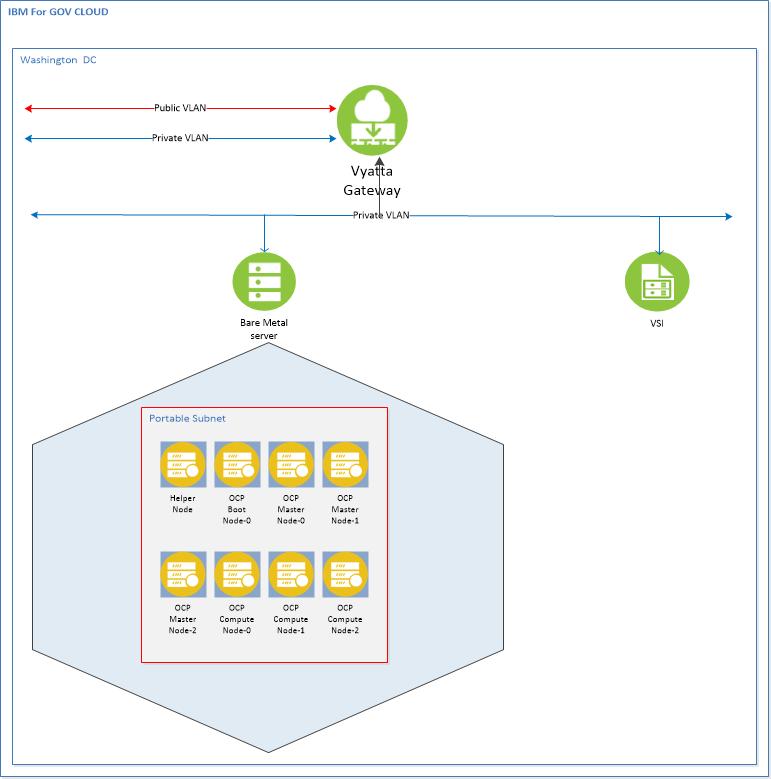

# ocpvmware


For deploying OCP 4.1  a minimum recommendation is to provision 1 ESXi server
and 1 Centos/Redhat VSI on the same VLAN in IBM Cloud for Government. For this
deployment we setup an ESXi Bare Metal server  with 48 CPU, 256 GB RAM, and 1 TB
storage. Your mileage may vary based on your specific needs.

The Centos/Redhat VSI is only required for a few hours and can de-provisioned
after the install is complete. The VSI is defined below.


> **NOTE**  Openshift 4.1 has a complicated installation.  The official RedHat
> documentation for installing Openshift 4.1 on VMware can be found here:
> [URL](https://docs.openshift.com/container-platform/4.1/installing/installing_vsphere/installing-vsphere.html)

> The information in this document is a consolidated installation process to get
> you up and running. For the full version and explanation, please refer here:
> [URL](https://docs.openshift.com/container-platform/4.1/installing/installing_vsphere/installing-vsphere.html)

> Before you begin, understanding your IP addresses is very important.  The IP
> addresses used in this process and the configuration files came from our IC4G
> environment. They are used here for illustration purpose only. Besides setting
> up your ESXi and vCenter server, you also need to order a minimum of 16 portable
> IP address which will be used to assign to the VMs. Each VM node takes up one
> IP address.  The recommended minimum of 16 portable IP addresses is determined by:
> 1 helper node + 1 boot node + 3 control-plane nodes + 3 worker nodes = 8 nodes
> IC4G reserves 4 IP addresses out of every portable IP subnet.  Therefore 8 + 4 = 12.
> The extra four IP addresses are for having a cushion.  This installation provisioned
> the vCenter on the same portable IP subnet, thus a total of 9 IP addresses are used.

## 	Architecture Diagram


## Hardware requirements

| Node Name       | vCPU   | Mem  | HDD | Role
| ------          | ------ |----  | --- | ------ |
| Helper Node | 4  | 16 | 150 | LB/DNS/Proxy/DHCP/OCP Installer|
| Bootstrap-0 | 4  | 16 | 150 | Bootstrap OCP |
| Control-plane-0  |  4 | 16 | 150 | Master OCP |
| Control-plane-1  |  4 | 16 | 150 | Master OCP |
| Control-plane-2  |  4 | 16 | 150 | Master OCP |
| compute-0 | 4 | 16 | 150 | Compute OCP |
| compute-1 | 4 | 16 | 150 | Compute OCP |
| compute-2 | 4 | 16 | 150 | Compute OCP |

## Prep the VSI System

- Provision a VSI with 2 vCPUs, 10 GB of RAM, and 100 GB of storage

- Install Required Packages.

- Download vCenter ISO image from VMware. (VMware website requires an account to download the ISO image)

#### Install Packages
After the VSI is provisioned, logon to the VSI as root. To run ansible scripts, ansible rpm and python library need to be installed:

```
sudo yum update
sudo yum install ansible
sudo yum install genisoimage
sudo yum install git
sudo yum install python-pip gcc make openssl-devel python-devel
sudo pip install --upgrade ansible
sudo pip install PyVmomi
sudo yum install p7zip*
sudo pip install jmespath
curl -L https://github.com/vmware/govmomi/releases/download/v0.20.0/govc_linux_amd64.gz | gunzip > /usr/local/bin/govc
chmod +x /usr/local/bin/govc
```

> ***HINT*** the Redhat server pip install command will fail. When it does, execute the following commands:
>> * subscription-manager repos --enable rhel-server-rhscl-7-rpms
>> * yum install python27-python-pip
>> *  scl enable python27 bash
>> *  which pip
>> *  pip -V

#### Download the vCenter Server Appliance
* Download the ISO images from [URL](https://my.vmware.com/web/vmware/details?downloadGroup=VC67U2&productId=742&rPId=33237)

* move it to /opt/repo

* Later in the step where vars.yaml is to be modified, update the vcenter_iso_name variable in vars.yaml with the downloaded ISO image name


#### Create a Portgroup in VMware
* Name = vmportgroup
	* Refer to the [URL](https://docs.vmware.com/en/VMware-vSphere/6.5/com.vmware.vsphere.html.hostclient.doc/GUID-67415625-FB59-4AE0-9E16-4FB39AEBC50B.html) VMware reference document for instruction on creating a portgroup.

#### Update the NTP server ESXi
* Connect to your ESXi host via vSphere host client  https://<ESXI_IP>/ui

* Then on the left, just bellow the host, select the Manage > System > Time and Date

* Update the NTP Server with correct NTP Server address for example 129.6.15.28,129.6.15.28

* Then click the Edit Settings button to bring up the configuration window. Set the NTP service startup policy as “Start and stop with host”. Like this everytime the host will reboot, the NTP service will be started automatically.

#### Download the Git repository
```
cd /opt
git clone https://github.com/fctoibm/ocpvmware.git
cd /opt/ocpvmware
```
> *** HINT *** For Redhat you might have to update the ansible path if playbook can not load python modules
> In ansible.cfg
> Under the [defaults]
>interpreter_python = /opt/rh/python27/root/usr/bin/python

* Edit the [vars.yaml](./vars.yaml) file with the IP addresss that will be assigned to the masters/workers/boostrap. The IP addresses need to be right since they will be used to create your OpenShift servers.

* Edit the [hosts](./hosts) file kvmguest section to match helper node information. This should be similar to vars.yaml file


## Running the playbooks

Running playbook 1, 2 and 3 will deploy the entire stack from vCenter to OCP v4.1. If vCenter already exist, skip playbook one and continue with playbook two.


### Run playbook One

Run the following playbook to setup vCenter:

```
ansible-playbook -e @vars.yaml  play1.yaml

```
> **HINT** After play1.yaml is completed, wait 15-30 mins to let the vCenter completes its deployment. Before proceeding to playbook 2, verify that vCenter has completed deployment by visiting  https://<vcenter_ip> and logon using the credential entered in the vars.yaml file.
>> The vCenter installation progress can be monitored by opening a browser and entering the following URL  https://<vCenter_IP>:5480


### Run playbook Two

Run the playbook 2 to deploy helper node OS and OCP4.1 VM's using terraform.

```
ansible-playbook -e @vars.yaml  play2.yaml

```

> **HINT** You will have press enter a key during Playbook 2 execution,
> this happens so the end-user can verify the helper VM is deployed successfully.


### Run playbook Three

Playbook 3 will update the helper node to act as Load Balancer/ Dynamic Host
Configuration Protocol / Preboot Execution Environment / Domain Name System
(LB/DHCP/PEX/DNS). This playbook will also restart the OCP VM's


```
ansible-playbook -e @vars.yaml  play3.yaml

```

### Should the Playbook(s) fail for some reason
If the ansible scripts fail you can execute the following script to clean up and reset the environment.
** Please exercise caution when using either of the clean up scripts. **

```
ansible-playbook -e @vars.yaml  clean_ocp_vms.yaml
```

> **HINT** Using ```clean_ocp_vms.yaml``` will delete all OCP related VM's.
> You should then be able to execute Play2 and Play3 playbooks to restart the OCP installation.

```
ansible-playbook -e @vars.yaml  clean_everything.yaml
```

> **HINT** Using ```clean_everything.yaml``` will delete the vCenter and all OCP related VMs.
> You should then be able to execute Play1, Play2 and Play3 playbook to resume OCP installation.
> ** Do not use this if you vCenter installation was successful and the vCenter is running properly.

## Wait for OCP 4.1 install

The boostrap VM actually does the install for you; you can track it with the following command by ssh into helper node guest KVM.

```
cd /opt/ocp4
openshift-install wait-for bootstrap-complete --log-level debug
```

Once you see this message

```
DEBUG OpenShift Installer v4.1.0-201905212232-dirty
DEBUG Built from commit 71d8978039726046929729ad15302973e3da18ce
INFO Waiting up to 30m0s for the Kubernetes API at https://api.ocp4.example.com:6443...
INFO API v1.13.4+838b4fa up                       
INFO Waiting up to 30m0s for bootstrapping to complete...
DEBUG Bootstrap status: complete                   
INFO It is now safe to remove the bootstrap resources
```

you can continue. At this point, the bootstrap server is no longer required and you can decommission it if you wish.

## Finish OCP Installation

ssh into the helper node. Execute the following commands:

```
cd /opt/ocp4
export KUBECONFIG=/opt/ocp4/auth/kubeconfig
```

Set up storage for you registry (to use Persistent Volumes (PVs) follow the instructions here: [URL](https://docs.openshift.com/container-platform/4.1/installing/installing_bare_metal/installing-bare-metal.html#registry-configuring-storage-baremetal_installing-bare-metal) )

```
oc patch configs.imageregistry.operator.openshift.io cluster --type merge --patch '{"spec":{"storage":{"emptyDir":{}}}}'
```

If you need to expose the registry, run this command

```
oc patch configs.imageregistry.operator.openshift.io/cluster --type merge -p '{"spec":{"defaultRoute":true}}'
```

finish up the install process
```
openshift-install wait-for install-complete
```
When messages similar to the following message are displayed, the installation is complete.
```
INFO Waiting up to 30m0s for the cluster at https://api.test.os.fisc.lab:6443 to initialize...
INFO Waiting up to 10m0s for the openshift-console route to be created...
INFO Install complete!                            
INFO To access the cluster as the system:admin user when using 'oc', run 'export KUBECONFIG=/opt/ocp4/auth/kubeconfig'
INFO Access the OpenShift web-console here: https://console-openshift-console.apps.test.os.fisc.lab
INFO Login to the console with user: kubeadmin, password: ###-????-@@@@-****
```
## Access OCP URL
Add following line to your /etc/hosts files on the server from where will allow access to your OpenShift URL:

> <Helper_HOST_IP> console-openshift-console.apps.<base_domain_prefix>.<base_domain> oauth-openshift.apps.<base_domain_prefix>.<base_domain>
